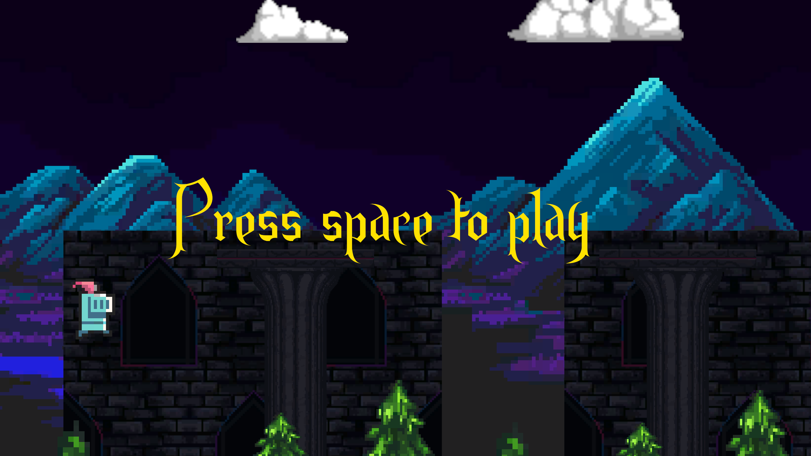
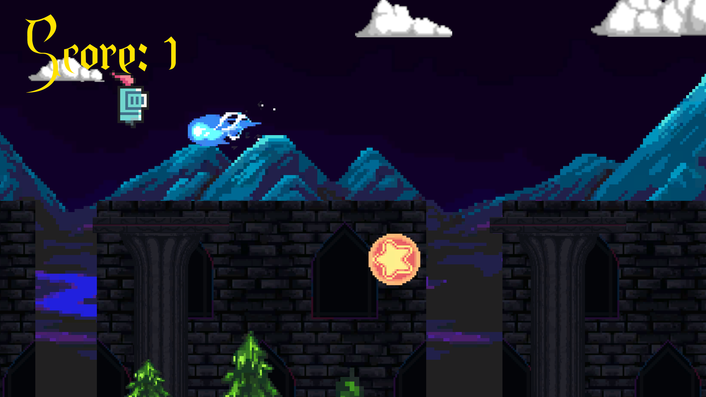

<h1 align="center">Dungeon Flappy Bird</h1>

Play as a flying knight dodging projectiles at night for some reason. Mountains and castles visible in the background, and trees slightly visible below. Fly too high, too low or get hit and you reset!

Simple sprites and animations included with a moving background.
Assets from <a href="https://itch.io/game-assets" target="_blank">itch.io game assets</a>.

<h1 align="center">Screenshots</h1>

  <h4>Press To Play</h4>
    
  <h4>In game</h4>
    

